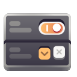

<p align="center">
  
</p>
<h1 align="center">Tuner</h1>
<h4 align="center">Extensible control center</h4>
<div align="center">
  
</div>

Tuner is the home for your additional system settings, components, applications, and whatever else you want!

- Extended control over the interface and functions using plugins.
- The interface is adapted to different device sizes.
- Easy installation from the repository.
- You can create your own plugins without affecting the main program code.
- Easy creation of plugins working with dconf and unlimited plugin functionality thanks to libpeas.

# Building

### Dependencies

- `libadwaita-1`
- `libpeas-2`
- `gee-0.8`
- `valac`

### Meson

```sh
meson setup --prefix=/usr build
meson install -C build
```

# Credit

[Refine](https://gitlab.gnome.org/TheEvilSkeleton/Refine) - For the idea of the logic of creating widgets interacting with gsettings directly in .blp files.

[GNOME Builder](https://gitlab.gnome.org/GNOME/gnome-builder) - For the idea of new widget & binding system

[Victoria Zubacheva](https://altlinux.space/vvv.dostt) - For creating an icon for Tuner.
